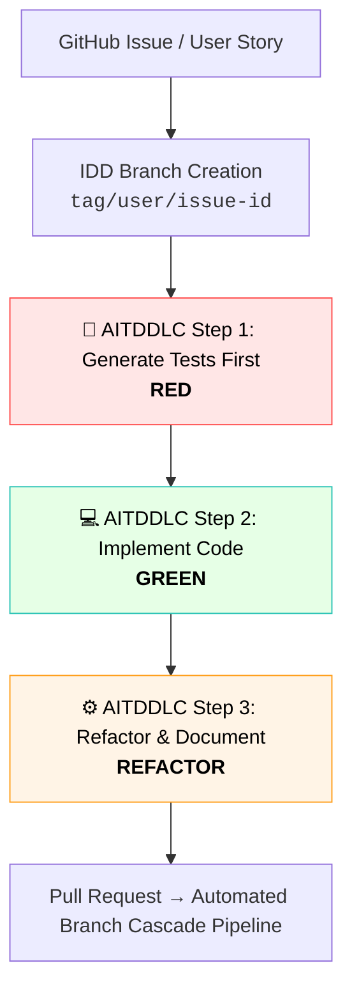
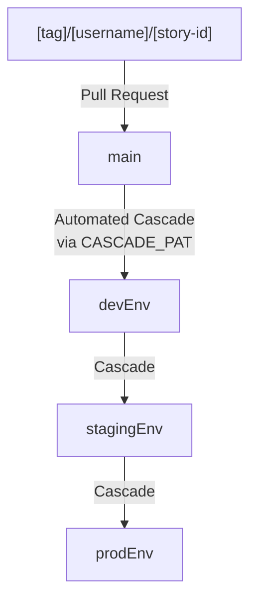

# <div align="center">PEND Boilerplate</div>

**<div align="center">PostgreSQL · Expo · NextJS · Django</div>**

A Production-Ready, Full-Stack Boilerplate with Multi-Tenant Architecture, Comprehensive CI / CD & Enterprise-Grade Security Patterns. Built for Rapid Scaffolding of New Projects.

[](https://github.com/corebit-bd/pend-boilerplate/actions/workflows/ci.yaml)
[](LICENSE)
[](SECURITY.md)
[](https://github.com/corebit-bd/pend-boilerplate/security)
[](CONTRIBUTING.md)
[](https://codecov.io/gh/corebit-bd/pend-boilerplate)
[](https://snyk.io/test/github/corebit-bd/pend-boilerplate)

---

## 📋 Table of Contents

- [Overview](#overview)
- [Features](#features)
- [Tech Stack](#tech-stack)
- [Quick Start](#quick-start)
- [Project Structure](#project-structure)
- [Branch Naming Convention](#branch-naming-convention)
- [Agile SCRUM, IDD & AITDDLC Framework](#agile-scrum-idd--aitddlc-framework)
- [Development Workflow](#development-workflow)
- [Scaffolding New Projects](#scaffolding-new-projects)
- [Branch Protection](#branch-protection)
- [CI / CD Pipeline](#ci--cd-pipeline)
- [Testing](#testing)
- [Security](#security)
- [Documentation](#documentation)
- [Contributing](#contributing)
- [License](#license)

---

## Overview

**PEND Boilerplate** is a Comprehensive, Production-Ready Foundation for Building Modern Full-Stack Applications. It combines Battle-Tested Technologies with Best Practices for Scalability, Security & Maintainability.

### Purpose

This Boilerplate serves as a **Template** for Rapidly Scaffolding New Projects while Maintaining :

- ✅ **High Quality Standards** - 80%+ Test Coverage, Automated CI / CD
- ✅ **AITDDLC & IDD Framework** - Issue-Driven Development paired with AI-Assisted Test-Driven Life-Cycle for rapid, Test-First Iteration
- ✅ **Production Security** - JWT Authentication, Audit Logging, Security Scans
- ✅ **Team Scalability** - Configurable Branch Protection, Comprehensive Documentation
- ✅ **Developer Experience** - Hot Reload, Storybook, Automated Scripts
- ✅ **Cost Efficiency** - $0 / Month CI / CD on Free Tier

### Use Cases

- SaaCS (Software As A Cloud Service) Applications with Multi-Tenancy
- Enterprise Web Applications
- Mobile-First Applications
- Headless CMS Implementations
- MicroServices Architectures
- API-First Platforms

---

## Features

### Core Capabilities

- 🏢 **Multi-Tenant Architecture** - Built-In Tenant Isolation at Application Level
- 🔐 **JWT Authentication** - Secure RSA256 Token-Based Authentication
- 📊 **Dual API Support** - GraphQL + REST for flexible Data Access
- 🎨 **Component Library** - 83 Storybook Stories, 99.78% Test Coverage
- 🔄 **Event-Driven** - Celery + Redis for Background Tasks
- 🐳 **Docker-First** - Production-Optimized Containers
- 🚀 **CI / CD Ready** - Automated Testing & Deployment
- 📝 **Audit Logging** - Automatic Database Change Tracking
- 🧪 **Comprehensive Testing** - Unit, Integration, E2E Tests
- 📚 **Complete Documentation** - Guides for All Components

### Developer Features

- ⚡ **Fast Development** - Hot Reload on All Platforms
- 🎭 **Visual Testing** - Storybook for Component Development
- 🔍 **Type Safety** - 100% TypeScript Frontend
- 🎯 **Branch Protection** - Automated Quality Gates
- 📈 **Code Quality** - Black, Flake8, ESLint, Prettier
- 🔧 **Automation Scripts** - Setup, Build, Deployment Scripts
- 📖 **Scaffolding Guide** - Template-Ready for New Projects
- 🤖 **AITDDLC Automated Harness** - AI-Driven Test Creation, Code Generation & Specification Updates
- 📋 **Issue-Driven Development (IDD)** - Strict Traceability connecting GitHub Issues, PRs & Branch Names.

---

## Tech Stack

### Backend

- **Django >=6.1,<6.2** - Web Framework
- **Django REST Framework >=3.18.0,<4.0** - RESTful APIs
- **FastAPI >=0.141.1,<1.0** - High-Performance Edge Services
- **Graphene-Django 3.2.3** - GraphQL Implementation
- **PostgreSQL 15** - Primary Database
- **Redis >=8.1.0,<9.0** - Caching & Task Queue
- **Celery 5.6.3** - Background Tasks
- **Gunicorn >=26.2.0,<27.0** + **Whitenoise >=6.12.0,<7.0** - Production Serving

### Frontend

- **NextJS 16** - ReactJS Framework with App Router
- **TypeScript** - Type-Safe JavaScript
- **Tailwind CSS v4** - Utility-First CSS
- **Redux Toolkit** - State Management
- **React Hook Form** + **Zod** - Form Handling & Validation
- **Storybook 10.4.1** - Component Documentation
- **Jest** + **ReactJS Testing Library** - Testing

### Mobile

- **Expo 57.0.14** - ReactJS Native Framework
- **React Native** - Cross-Platform Mobile Application Development

### DevOps

- **Docker** + **Docker Compose** - Containerization
- **GitHub Actions** - CI / CD Automation
- **GitHub Container Registry** - Docker Image Storage
- **Multi-Stage Builds** - Optimized Production Images

### Testing & Quality

- **pytest >=9.1.1,<10.0 - Python Testing
- **Jest** - JavaScript Testing
- **Codecov** - Code Coverage Reporting
- **Trivy** - Security Vulnerability Scanning
- **Black** + **Flake8** + **isort** - Python Linting
- **ESLint** - JavaScript / TypeScript Linting

---

## Quick Start

### Prerequisites

- **Docker** & **Docker Compose** (Recommended)
- **Python 3.13+** (For Local Backend Development)
- **NodeJS 24+** (For Local Frontend Development)
- **Git** for Version Control

### Installation

1. **Clone the Repository:**

   ```bash
   git clone https://github.com/corebit-bd/pend-boilerplate.git
   cd pend-boilerplate
   ```

2. **Run Setup Script** :

   ```bash
   ./scripts/setup.sh
   ```

   This Script will :
   - Create Environment Files from Templates
   - Set Up Python Virtual Environment
   - Install All Dependencies
   - Initialize the Database
   - Create Docker Network

3. **Configure Environment Variables** :

   ```bash
   # Edit the Generated .env Files
   nano .env                    # Root Configuration
   nano backend/.env            # Backend Configuration
   nano frontend/.env.local     # Frontend Configuration
   nano mobile/.env             # Mobile Configuration
   ```

4. **Start Development Servers** :

   ```bash
   ./scripts/dev-start.sh
   ```

5. **Access the Applications** :
   - Frontend : http://localhost:3000
   - Backend API : http://localhost:8000
   - API Documentation : http://localhost:8000/swagger/
   - Admin Panel : http://localhost:8000/admin/
   - GraphQL Playground : http://localhost:8000/graphql
   - Storybook : http://localhost:6006

### Building for Production

```bash
# Build All Services
./scripts/build.sh --env production --cleanup

# Build Specific Components
./scripts/build.sh --backend-only --cleanup
./scripts/build.sh --frontend-only --cleanup
```

---

## Project Structure

```tree
pend-boilerplate/
├── .github/
│   ├── ISSUE_TEMPLATE/
│   │   ├── bug_report.yaml
│   │   ├── config.yaml
│   │   ├── documentation.yaml
│   │   ├── feature_request.yaml
│   │   ├── performance.yaml
│   │   └── question.yaml
│   ├── workflows/
│   │   ├── branch-cascade.yaml
│   │   ├── cd.yaml
│   │   ├── ci.yaml
│   │   ├── dependabot-ai-fixer.yaml
│   │   └── dependabot-auto-merge.yaml
│   ├── dependabot.yaml
│   └── PULL_REQUEST_TEMPLATE.md
├── .mcp/
│   └── harness/
│       └── update_docs_agent.py
├── backend/
│   ├── apps/
│   │   ├── authentication/
│   │   │   ├── migrations/
│   │   │   │   └── __init__.py
│   │   │   ├── __init__.py
│   │   │   ├── admin.py
│   │   │   ├── apps.py
│   │   │   ├── models.py
│   │   │   ├── tests.py
│   │   │   └── views.py
│   │   ├── tenants/
│   │   │   ├── migrations/
│   │   │   │   └── __init__.py
│   │   │   ├── __init__.py
│   │   │   ├── admin.py
│   │   │   ├── apps.py
│   │   │   ├── models.py
│   │   │   ├── tests.py
│   │   │   └── views.py
│   │   ├── users/
│   │   │   ├── migrations/
│   │   │   │   └── __init__.py
│   │   │   ├── __init__.py
│   │   │   ├── admin.py
│   │   │   ├── apps.py
│   │   │   ├── models.py
│   │   │   ├── tests.py
│   │   │   └── views.py
│   │   └── __init__.py
│   ├── core/
│   │   ├── settings/
│   │   │   ├── __init__.py
│   │   │   ├── base.py
│   │   │   ├── development.py
│   │   │   ├── production.py
│   │   │   └── staging.py
│   │   ├── __init__.py
│   │   ├── asgi.py
│   │   ├── urls.py
│   │   └── wsgi.py
│   ├── logs/
│   │   └── .gitkeep
│   ├── mcp_server/
│   │   ├── services/
│   │   │   ├── codebase_watcher.py
│   │   │   ├── document_indexer.py
│   │   │   └── gemini_agent_runner.py
│   │   └── config.py
│   ├── shared/
│   │   ├── exceptions/
│   │   │   └── __init__.py
│   │   ├── middleware/
│   │   │   └── __init__.py
│   │   ├── utils/
│   │   │   ├── __init__.py
│   │   │   └── inspectors.py
│   │   └── __init__.py
│   ├── .dockerignore
│   ├── .env.example
│   ├── .flake8
│   ├── .gitignore
│   ├── Dockerfile
│   ├── manage.py
│   ├── pyproject.toml
│   ├── pytest.ini
│   ├── README.md
│   ├── requirements-dev.txt
│   └── requirements.txt
├── database/
│   ├── backups/
│   │   └── .gitkeep
│   ├── init/
│   │   ├── 01-init-database.sql
│   │   ├── 02-create-users.sql
│   │   └── README.md
│   └── migrations/
│       └── .gitkeep
├── documentation/
│   ├── 00_ci-cd/
│   │   ├── GITHUB_SECRETS_SETUP.md
│   │   ├── MAINTENANCE.md
│   │   ├── README.md
│   │   ├── STRATEGY.md
│   │   ├── TROUBLESHOOTING.md
│   │   └── UPGRADE_GUIDE.md
│   ├── 01_user-requirements-specifications/
│   │   ├── 01_PROJECT_KICKOFF.md
│   │   ├── 02_MARKET_RESEARCH.md
│   │   ├── 03_COMPETITOR_ANALYSIS.md
│   │   ├── 04_USER_PERSONAS_SPECIFICATION.md
│   │   └── 05_INITIAL_BACKLOG.md
│   └── 02-design-specifications/
│       ├── 01_BASIC_STYLE_GUIDE_SPECIFICATION.md
│       ├── 02_BASIC_SYSTEM_ARCHITECTURE_DESIGN_SPECIFICATION.md
│       ├── 03_BASIC_TECHNOLOGY_STACK_SPECIFICATION.md
│       ├── 04_MULTIPLE_ENVIRONMENTS_DESIGN_SPECIFICATION.md
│       ├── 05_BASIC_INFRASTRUCTURE_DESIGN_SPECIFICATION.md
│       ├── 06_DATABASE_SCHEMA_DESIGN_SPECIFICATION.md
│       ├── 07_INTEGRATION_SCOPE_IDENTIFICATION_DESIGN_SPECIFICATION.md
│       ├── 08_SECURITY_REQUIREMENTS_SPECIFICATION.md
│       ├── 09_QUALITY_ASSURANCE_MANAGEMENT_SPECIFICATION.md
│       ├── 10_LOG_MANAGEMENT_SPECIFICATION.md
│       ├── 11_RELEASE_DEPLOYMENT_DESIGN_SPECIFICATION.md
│       ├── 12_OPERATIONAL_MAINTENANCE_SPECIFICATION.md
│       └── 13_SCALABILITY_CONSIDERATION_SPECIFICATION.md
├── frontend/
│   ├── .storybook/
│   │   ├── main.ts
│   │   ├── preview.ts
│   │   └── vitest.setup.ts
│   ├── public/
│   │   ├── file.svg
│   │   ├── globe.svg
│   │   ├── next.svg
│   │   ├── vercel.svg
│   │   └── window.svg
│   ├── src/
│   │   ├── app/
│   │   │   ├── favicon.ico
│   │   │   ├── globals.css
│   │   │   ├── layout.tsx
│   │   │   └── page.tsx
│   │   ├── components/
│   │   │   ├── ui/
│   │   │   │   ├── __tests__/
│   │   │   │   │   ├── Badge.test.tsx
│   │   │   │   │   ├── Button.test.tsx
│   │   │   │   │   ├── Icon.test.tsx
│   │   │   │   │   ├── Input.test.tsx
│   │   │   │   │   └── Spinner.test.tsx
│   │   │   │   ├── Badge.stories.tsx
│   │   │   │   ├── Badge.tsx
│   │   │   │   ├── Button.stories.tsx
│   │   │   │   ├── Button.tsx
│   │   │   │   ├── Icon.README.md
│   │   │   │   ├── Icon.stories.tsx
│   │   │   │   ├── Icon.tsx
│   │   │   │   ├── Input.stories.tsx
│   │   │   │   ├── Input.tsx
│   │   │   │   ├── Spinner.stories.tsx
│   │   │   │   └── Spinner.tsx
│   │   │   └── Providers.tsx
│   │   ├── lib/
│   │   │   ├── api/
│   │   │   │   └── client.ts
│   │   │   ├── constants/
│   │   │   │   └── api.ts
│   │   │   └── utils/
│   │   │       └── helpers.ts
│   │   ├── schemas/
│   │   │   ├── authSchemas.ts
│   │   │   └── userSchemas.ts
│   │   ├── store/
│   │   │   ├── slices/
│   │   │   │   ├── authSlice.ts
│   │   │   │   └── userSlice.ts
│   │   │   └── index.ts
│   │   └── types/
│   │       ├── auth.ts
│   │       └── user.ts
│   ├── .dockerignore
│   ├── .gitignore
│   ├── Dockerfile
│   ├── eslint.config.mjs
│   ├── jest.config.ts
│   ├── jest.setup.ts
│   ├── next.config.ts
│   ├── package-lock.json
│   ├── package.json
│   ├── postcss.config.mjs
│   ├── README.md
│   ├── tsconfig.json
│   ├── vitest.config.ts
│   └── vitest.shims.d.ts
├── mobile/
│   ├── assets/
│   │   ├── adaptive-icon.png
│   │   ├── favicon.png
│   │   ├── icon.png
│   │   └── splash-icon.png
│   ├── .env.example
│   ├── .gitignore
│   ├── app.json
│   ├── App.tsx
│   ├── index.ts
│   ├── package-lock.json
│   ├── package.json
│   └── tsconfig.json
├── scripts/
│   ├── build.sh
│   ├── dev-start.sh
│   ├── README.md
│   └── setup.sh
├── .env.development.example
├── .env.docker.example
├── .env.example
├── .env.production.example
├── .env.staging.example
├── .gitguardian.yaml
├── .gitignore
├── AGENTS.md
├── BOILERPLATE_CONTEXT.md
├── CHANGELOG.md
├── CODE_OF_CONDUCT.md
├── CONTRIBUTING.md
├── developer-workflow.png
├── docker-compose.yaml
├── LICENSE
├── LICENSE-THIRD-PARTY.md
├── README.md
└── SECURITY.md
```

---

## Branch Naming Convention

This Project uses a **Strict 13-Tag Branch Naming Convention** to maintain Organization & Trigger Appropriate CI / CD Workflows.

### Format

```
[tag]/[username]/[story-id]
```

### Available Tags

| Tag              | Purpose                               | Example                                |
| ---------------- | ------------------------------------- | -------------------------------------- |
| `feature/`       | New Features / Enhancements           | `feature/jzhk/user-authentication-123` |
| `fix/`           | Bug / Error Fixes                     | `fix/ijs/login-error-456`              |
| `documentation/` | Documentation Updates                 | `documentation/smd/api-docs-789`       |
| `style/`         | UI / UX Design Changes                | `style/jzhk/button-design-231`         |
| `refactor/`      | Code Refactoring (No Behavior Change) | `refactor/ijs/cleanup-utils-321`       |
| `data/`          | Data Manipulation / Changes           | `data/jk/seed-users-111`               |
| `test/`          | Adding / Updating Tests               | `test/jzhk/unit-tests-654`             |
| `chore/`         | Build Scripts, Dependencies, Config   | `chore/smd/update-deps-987`            |
| `cicd/`          | CI / CD Configuration / Scripts       | `cicd/smd/setup-actions-432`           |
| `performance/`   | Performance Improvements              | `performance/jzhk/fast-reload-999`     |
| `devEx/`         | Developer Experience Improvements     | `devEx/jzhk/vscode-config-342`         |
| `revert/`        | Reverting Previous Commits            | `revert/ijs/broken-feature-289`        |
| `miscellaneous/` | Anything Not Fitting Above Tags       | `miscellaneous/smd/temp-fix-752`       |

### Special Branches

**Backup Branches** (Pre-Upgrade Snapshots) :

```
backup/pre-[update]-[YYYYMMDD]

Examples :
backup/pre-django5-20241230
backup/pre-nextjs16-20241225
```

**Upgrade Branches** (Major Version Upgrades) :

```
chore/upgrade/[component]

Examples :
chore/upgrade/backend
chore/upgrade/frontend
chore/upgrade/database
```

**Environment Branches** :

- `main` - Integration Branch, Always deployable
- `devEnv` - Development Environment
- `stagingEnv` - QA / Staging Environment
- `prodEnv` - Production Environment

### Examples

**✅ Good** :

```bash
feature/jzhk/user-registration-123
fix/alice/login-timeout-456
documentation/bob/api-guide-789
style/carol/responsive-nav-231
refactor/dave/auth-service-321
```

**❌ Bad** :

```bash
❌ my-feature-branch          # No Tag
❌ feature-user-auth          # Missing Username & Story ID
❌ feature/User-Auth-123      # Not Lowercase
❌ quick-fix                  # Doesn't Follow Convention
```

**See** : [CONTRIBUTING.md](CONTRIBUTING.md#branch-naming-convention) for Complete Guide

---

## Agile SCRUM, IDD & AITDDLC Framework

This project follows an **Issue-Driven Development (IDD)** approach embedded inside an **Agile SCRUM** Workflow, augmented by the **Artificial Intelligence Test-Driven Development Life-Cycle (AITDDLC)**.



### 1. Issue-Driven Development (IDD)

- Every code change begins with a tracked **GitHub Issue** containing user requirements and acceptance criteria.
- Branches must explicitly map back to an Issue ID using the strict Branch Naming Tag System (Example : `feature/jzhk/issue-123`).
- Pull Requests must reference the Issue ID to enable Automatic Resolution & E2E Traceability upon merging.

### 2. Artificial Intelligence Test-Driven Development Life-Cycle (AITDDLC)

The repository leverages automated AI agents (`.mcp/harness/`) to drive code development via a strict test-first methodology:

1. **Specification & Harness Phase** : Architectural specifications generated in `documentation/01_*` and `documentation/02_*` must include mandatory **Mermaid syntax diagrams** to visually depict flows and system structure before implementation.
2. **RED Phase (Test First)** : Automated AI harnesses generate or update unit and integration test suites based on Issue Specifications before Business Logic is written, establishing failing tests.
3. **GREEN Phase (Implementation)** : Core code is developed to satisfy the newly generated tests until all suite checks pass successfully.
4. **REFACTOR Phase (Optimization)** : Code is refactored for Performance, Architecture Patterns & Security, accompanied by automated docstring and `AGENTS.md` updates while maintaining 100% Test Pass rates.

---

## Development Workflow

### Git Flow & Automated Cascade



1. **PR to `main`** : Developers open Pull Requests targeting `main`.
2. **Sequential Cascade Execution** : Merges to `main` trigger the `Automated Branch Cascade` Workflow, which uses the `CASCADE_PAT` Secret to bypass rulesets & propagate Changes downstream sequentially (`main` $\rightarrow$ `devEnv` $\rightarrow$ `stagingEnv` $\rightarrow$ `prodEnv`).

### Creating a Feature

```bash
# 1. Create Feature Branch
git checkout -b feature/yourname/add-feature-123

# 2. Make Changes & Commit
git add .
git commit -m "feature : Added New Feature

- Implemented Feature X
- Added Tests
- Updated Documentation

Reference Issue : #123"

# 3. Run Tests Locally
cd backend
pytest

cd frontend
npm test

# 4. Push & Create PR
git push origin feature/yourname/add-feature-123

# 5. CI Runs Automatically
# - Backend Tests
# - Frontend Tests
# - Mobile Tests
# - Security Scans
# - Docker Builds

# 6. Merge when CI Passes (And Reviewed If Team)
# - Use "Squash and merge" for Clean History

# 7. Auto-Deploy to "devEnv" Branch
# - Monitor Deployment
# - Verify Changes
```

### Working with Tests

```bash
# Backend
cd backend
source venv/bin/activate
pytest --cov                    # Run with Coverage
pytest -v                       # Verbose Output
pytest --lf                     # Last Failed
pytest apps/users/tests/test_models.py  # Specific File

# Frontend
cd frontend
npm test                        # Run All Tests
npm test -- --coverage          # With Coverage
npm test -- --watch             # Watch Mode
npm test -- Button.test.tsx     # Specific File

# Storybook
npm run storybook               # Start Storybook
npm run build-storybook         # Build Static Version
```

### Code Quality

```bash
# Backend Formatting
cd backend
black .                         # Format Code
flake8                          # Check Linting
isort .                         # Sort Imports

# Frontend Linting
cd frontend
npm run lint                    # Check Linting
npm run lint:fix                # Auto-Fix Issues
npm run type-check              # TypeScript Check
```

---

## Scaffolding New Projects

This Boilerplate is **Template-Ready** for Creating New Projects. Follow these Steps to Scaffold A New Application :

### Step 1 : Create New Repository

**Option A : Use GitHub Template**

1. Click `Use this template` Button on GitHub
2. Name Your New Repository
3. Clone Locally

**Option B : Manual Clone**

```bash
git clone https://github.com/corebit-bd/pend-boilerplate.git my-new-project
cd my-new-project
rm -rf .git
git init
git add .
git commit -m "chore : Commited Initially from PEND Boilerplate"
```

### Step 2 : Customize Configuration

```bash
# 1. Update Project Name Throughout
# Search & Replace "pend-boilerplate" with "your-project-name"
# Files to Update :
# - README.md
# - package.json (frontend, mobile)
# - docker-compose.yml
# - All .env.example Files
# - Documentation Files

# 2. Configure Environments
cp .env.example .env
cp backend/.env.example backend/.env
cp frontend/.env.local.example frontend/.env.local
cp mobile/.env.example mobile/.env

# Edit Each .env File with Your Configuration

# 3. Update Branding
# - Replace Logos in "frontend/public/"
# - Update Color Scheme in "frontend/src/app/globals.css"
# - Update Meta Tags in "frontend/src/app/layout.tsx"
```

### Step 3 : Set Up GitHub

```bash
# 1. Create GitHub Repository
gh repo create your-project-name --private

# 2. Push Code
git remote add origin https://github.com/your-username/your-project-name.git
git branch -M main
git push -u origin main

# 3. Create Environment Branches
git checkout -b devEnv && git push origin devEnv
git checkout -b stagingEnv && git push origin stagingEnv
git checkout -b prodEnv && git push origin prodEnv
git checkout main
```

### Step 4 : Configure Branch Protection

Based on Your Team Size, Configure Appropriate Protection :

**Solo Developer** :

- PR Required, 0 Approvals
- All CI Checks Required
- Fast Iteration

**Small Team (2-5)** :

- PR Required, 1 Approval
- All CI Checks Required
- CODEOWNERS Optional

**Medium / Large Team (6+)** :

- PR Required, 1-2 Approvals
- All CI Checks Required
- CODEOWNERS Required
- Review Assignments Enabled

**See** : [Branch Protection](#branch-protection) section below

### Step 5 : Configure GitHub Secrets

```bash
# In GitHub : Settings → Secrets and variables → Actions

# Optional But Recommended :
CODECOV_TOKEN=xxx               # Code Coverage Reporting
CHROMATIC_PROJECT_TOKEN=xxx     # Storybook Visual Testing
EXPO_TOKEN=xxx                  # Mobile Application Builds
```

**See** : [Github Secrets Setup](documentation/ci-cd/GITHUB_SECRETS_SETUP.md)

### Step 6 : Initial Development

```bash
# 1. Run Setup
./scripts/setup.sh

# 2. Start Development
./scripts/dev-start.sh

# 3. Verify Everything Works
# Open : http://localhost:3000 (Frontend)
# Open : http://localhost:8000 (Backend)

# 4. Run Tests
cd backend
pytest
cd frontend
npm test

# 5. Make Your First Change
git checkout -b feature/yourname/initial-customization-1
# ... Make Changes ...
git commit -m "feature : Customized Boilerplate for [project-name]"
git push origin feature/yourname/initial-customization-1
# Create PR & Merge
```

### Scaffolding Checklist

- [ ] Repository Created on GitHub
- [ ] Project Name Updated Throughout
- [ ] Environment Variables Configured
- [ ] Branding / Logos Updated
- [ ] Environment Branches Created
- [ ] Branch Protection Configured
- [ ] GitHub Secrets Added
- [ ] Setup Script Runs Successfully
- [ ] All Tests Passing
- [ ] Docker Containers Working
- [ ] CI / CD Pipeline Green
- [ ] First Deployment Successful

**For Complete Guide, See** : [CONTRIBUTING.md - Scaffolding New Projects](CONTRIBUTING.md#scaffolding-new-projects)

---

## Branch Protection

This Boilerplate uses **GitHub Rulesets** for Flexible, Scalable Branch Protection.

### Protection Rules

#### Main Branch (`main`)

- ✅ Pull Request Required
- ⚙️ Approvals : Configurable (0 for Solo, 1+ for Teams)
- ✅ All CI Checks Must Pass :
  - `backend-tests` - pytest, Linting, Coverage
  - `frontend-tests` - Jest, ESLint, `type-check`
  - `mobile-tests` - Jest, Expo Validation
  - `docker-build` - Container Build Validation
  - `security-scan` - Trivy, `npm audit`, safety
- ✅ Branch Must be Up-To-Date
- ✅ Force Pushes Blocked
- ✅ Linear History Enforced

#### Development Environment Branch (`devEnv`)

- ✅ Pull Request Required
- ⚙️ Approvals : 0 for Solo, 1+ for Teams
- ✅ All Status Checks Must Pass
- ✅ Force Pushes Blocked
- ✅ Deletion Restricted

#### Staging / QA Environment Branch (`stagingEnv`)

- ✅ Pull Request Required
- ⚙️ Approvals : 0 for Solo, 1 for QA / Team Lead
- ✅ All Status Checks Must Pass
- ✅ Force Pushes Blocked
- ✅ Deletion Restricted

#### Production Environment Branch (`prodEnv`)

- ✅ Pull Request Required
- ⚙️ Approvals : 0 for Solo, 1-2 for Maintainers Only
- ✅ All Status Checks Must Pass
- ✅ Force Pushes Blocked
- ✅ Deletion Restricted

#### Backup Branches (`backup/**`)

- ✅ Force Pushes Blocked (Immutable)
- ✅ Deletion Restricted (Permanent)
- ❌ No Status CI Checks (Snapshots Only)

#### Upgrade Branches (`chore/upgrade/**`)

- ✅ Pull Request Required
- ⚙️ Enhanced Approvals (1 - 2+)
- ✅ All CI Checks Must Pass
- ✅ **Upgrade Validation Check** - Verifies Backup Exists
- ✅ Extended Testing Required

### Team Size Configuration

**Solo Developer** :

```yaml
main: 0 Approval Required (Self-Review Encouraged)
devEnv: 0 Approval (Self-Review Encouraged)
stagingEnv: 0 Approval (Self-Review Encouraged)
prodEnv: 0 Approval (Self-Review Encouraged)
```

**Small Team (2-5)** :

```yaml
main: 1 Approval Required
devEnv: 0 Approval
stagingEnv: 1 Approval
prodEnv: 1 Approval
```

**Medium Team (6-15)** :

```yaml
main: 1-2 Approvals Required
devEnv: 0 Approval
stagingEnv: 1 Approval (QA Lead)
prodEnv: 2 Approvals (Maintainers)
```

**Large Team (15+)** :

```yaml
main: 2 Approvals Required
devEnv: 1 Approval
stagingEnv: 2 Approvals
prodEnv: 2-3 Approvals (CODEOWNERS Enforced)
```

### Setting Up Protection

1. Go to Repository **Settings → Rules → Rulesets**
2. Create 6 Rulesets :
   - `main-branch-protection`
   - `devEnv-branch-protection`
   - `stagingEnv-branch-protection`
   - `prodEnv-branch-protection`
   - `backup-branches-protection`
   - `upgrade-branches-protection`
3. Configure based on Team Size
4. Enable GitHub Actions

**For Detailed Setup** : [CONTRIBUTING.md - Branch Protection Rules](CONTRIBUTING.md#branch-protection-rules)

---

## CI / CD Pipeline

### Continuous Integration (CI)

**Triggers** : Push to `main`, `devEnv` | PRs to Any Protected Branch

**Pipeline Steps** :

1. **Backend Tests**
   - pytest with Coverage (80%+ Required)
   - Black, Flake8, isort Checks
   - Django Migrations Check
2. **Frontend Tests**
   - Jest with Coverage (80%+ Required)
   - ESLint Checks
   - TypeScript Type Checking
3. **Mobile Tests**
   - Jest for React Native
   - Expo Validation
4. **Docker Builds**
   - Multi-Stage Build Validation
   - Image Optimization Checks
5. **Security Scans**
   - Trivy Container Scanning
   - `npm audit` for Frontend
   - Safety Check for Backend
   - SAST Analysis
6. **Storybook**
   - Build Storybook
   - Deploy to Chromatic (If Configured)
7. **E2E Tests** (PR Only)
   - Critical User Flows
   - Cross-Browser Testing

8. **Upgrade Validation** (Upgrade Branches Only)
   - Verify Backup Branch Exists
   - Warn about Major Version Changes

9. **Dependabot AI Review** (Dependabot PRs Only)
   - Powered by the **`google-genai`** Python SDK using **`gemini-3.7-flash`** as the default model engine.
   - `PRReviewerAgent` executes an automated Security & Code Quality Review, posting a Gemini Markdown Review directly to the PR.
   - Auto-merge is disabled; Maintainers verify CI Execution & manually perform a squash-merge.
   - Workflow token is strictly scoped to `contents: read` & `pull-requests: write`.

### Continuous Deployment (CD)

**Triggers** : Push to `devEnv`, `stagingEnv`, `prodEnv` | Version Tags

**Deployment Flow** :

1. **Build & Push**
   - Build Docker Images
   - Push to GitHub Container Registry
   - Tag with Environment & Version

2. **Deploy**
   - Pull Latest Images
   - Run Database Migrations
   - Deploy to Target Environment
   - Health Check Validation

3. **Smoke Tests**
   - API Health Checks
   - Critical Endpoint Validation
   - Database Connectivity

4. **Notifications**
   - Slack / Email Notifications
   - Deployment Status Updates

5. **Rollback** (Production Only)
   - Automatic Rollback on Failure
   - Restore Previous Version
   - Notify Team

> **Automated Multi-Branch Cascade** : Merges into `main` trigger the `Automated Branch Cascade` Workflow authenticated via `CASCADE_PAT` (Repository Administrator Role), safely propagating builds from `main` to `devEnv`, `stagingEnv` & `prodEnv` sequentially without manual intervention.

### Cost Analysis

**Monthly Usage (Free Tier)** :

```
Main Branch    :  ~1,870 Minutes (5 Pushes / Day)
Development    :  ~748 Minutes (2 Pushes / Day)
Staging    PRs :  ~36 Minutes (1 Push / Week)
Production PRs :  ~18 Minutes (2 Pushes / Month)

Total : ~1,672 Minutes / Month
GitHub Free : 2,000 Minutes / Month
Cost : $0 / Month ✅
```

### Pipeline Status

[](https://github.com/corebit-bd/pend-boilerplate/actions/workflows/ci.yaml)

**See Detailed Documentation** :

- [CI / CD Overview](documentation/ci-cd/README.md)
- [Testing Strategy](documentation/ci-cd/STRATEGY.md)
- [Troubleshooting](documentation/ci-cd/TROUBLESHOOTING.md)

---

## Testing

### Coverage Requirements

- **Backend** : 80%+ Code Coverage
- **Frontend** : 80%+ Code Coverage
- **UI Components** : 95%+ Coverage
- **Current Status** : 99.78% on UI Components ✅

### Test Structure

**Backend (`pytest`)** :

```
backend/apps/[app]/tests/
├── test_models.py          # Model Tests
├── test_views.py           # API Endpoint Tests
├── test_serializers.py     # Serializer Tests
├── test_services.py        # Business Logic Tests
└── factories.py            # Test Data Factories
```

**Frontend (Jest)** :

```
frontend/src/
├── components/ui/
│   ├── Button.tsx
│   ├── Button.test.tsx     # Unit Tests (99.78% Coverage)
│   └── Button.stories.tsx  # Storybook Stories
├── lib/
│   └── api/api.test.ts
└── utils/
    └── validation.test.ts
```

### Running Tests

```bash
# All Tests
npm run test:all              # Root : Runs backend + frontend

# Backend Only
cd backend
pytest                        # All Tests
pytest --cov                  # With Coverage
pytest --cov-report=html      # HTML Coverage Report

# Frontend Only
cd frontend
npm test                      # All Tests
npm test -- --coverage        # With Coverage
npm test -- --watch           # Watch Mode

# Storybook
npm run storybook             # Interactive Component Testing
```

### Storybook

83 Comprehensive Stories across 5 UI Components :

- Button (20 Variants)
- Input (18 Variants)
- Badge (15 Variants)
- Spinner (15 Variants)
- Icon (15 Variants)

Access : http://localhost:6006

---

## Documentation

### Project Documentation

- **[README.md](README.md)** - This File, Project Overview
- **[CONTRIBUTING.md](CONTRIBUTING.md)** - Comprehensive Contribution Guide
- **[CHANGELOG.md](CHANGELOG.md)** - Version History & Changes
- **[LICENSE](LICENSE)** - MIT License

### Component Documentation

- **[Backend Guide](backend/README.md)** - Django Backend Development
- **[Frontend Guide](frontend/README.md)** - NextJS Frontend Development
- **[Database Guide](database/init/README.md)** - PostgreSQL Setup & Management
- **[Scripts Guide](scripts/README.md)** - Automation Scripts Usage
- **[Icon Component](frontend/src/components/ui/Icon.README.md)** - Icon Integration Guide

### CI / CD Documentation

- **[CI / CD Overview](documentation/ci-cd/README.md)** - Pipeline Overview & Quick Start
- **[GitHub Secrets Setup](documentation/ci-cd/GITHUB_SECRETS_SETUP.md)** - Secrets Configuration
- **[Testing Strategy](documentation/ci-cd/STRATEGY.md)** - Hybrid Testing Approach
- **[Troubleshooting](documentation/ci-cd/TROUBLESHOOTING.md)** - Common Issues & Solutions
- **[Upgrade Guide](documentation/ci-cd/UPGRADE_GUIDE.md)** - Major Version Upgrade Procedures

### API Documentation

- **Swagger UI** : http://localhost:8000/swagger/
- **ReDoc** : http://localhost:8000/redoc/
- **GraphQL Playground** : http://localhost:8000/graphql

---

## Contributing

We welcome Contributions! This Boilerplate is Designed to be improved by the Community.

### Quick Contribution Guide

1. **Fork the Repository**
2. **Create a Feature Branch** following Naming Convention

   ```bash
   git checkout -b feature/yourname/your-feature-123
   ```

3. **Make Changes & Test**

   ```bash
   cd backend
   pytest
   cd frontend
   npm test
   ```

4. **Commit with Conventional Format**

   ```bash
   git commit -m "feature : Added Feature

   - Detailed Description
   - What Changed?
   - Why it is Changed?

   Reference Issue : #123"
   ```

5. **Push & Create PR**

   ```bash
   git push origin feature/yourname/your-feature-123
   ```

6. **Wait for CI Checks** - All Tests Must Pass
7. **Get Review** (If Team Repository)
8. **Merge** - Use `Squash and merge`

### Branch Naming

Must Follow : `[tag]/[username]/[story-id]`

13 Available Tags : `feature/`, `fix/`, `documentation/`, `style/`, `refactor/`, `data/`, `test/`, `chore/`, `cicd/`, `performance/`, `devEx/`, `revert/`, `miscellaneous/`

### Code Standards

- **Python** : Black (88 Characters), Flake8, isort, Type Hints
- **TypeScript** : ESLint, Strict Mode, Named Exports
- **Tests** : 80%+ Coverage Required
- **Commits** : Conventional Commits Format
- **Documentation** : Update Relevant Documents

### Special Branches

**Backup Branches** (Before Major Upgrades) :

```bash
backup/pre-django5-20241230
```

**Upgrade Branches** (Major Version Changes) :

```bash
chore/upgrade/backend
```

### For Complete Guide

See **[CONTRIBUTING.md](CONTRIBUTING.md)** for :

- Detailed Branch Naming Rules
- Pull Request Process
- Testing Requirements
- Code Standards
- Scaffolding Guide
- Upgrade Procedures

---

## License

This Project is Licensed under the MIT License - See the [LICENSE](LICENSE) File for Details.

3rd Party Licenses & Attributions can be found in [LICENSE-THIRD-PARTY.md](LICENSE-THIRD-PARTY.md).

---

## Acknowledgments

- Django & Django REST Framework Teams
- NextJS & ReactJS Teams
- Expo & React Native Communities
- All Open-Source Contributors

---

## Support

### Issues & Questions

- **Bug Reports** : Open An Issue with the Bug Template
- **Feature Requests (FR)** : Open An Issue with the Feature Template
- **Questions** : Check Documentation First, Then Open A Discussion

---

## Security

Security is a Top Priority for the PEND Boilerplate. We have implemented Multiple Layers of Security & Follow Industry Best Practices.

### Reporting Vulnerabilities

If you discover a Security Vulnerability, Please Follow Our [Security Policy](SECURITY.md) for Responsible Disclosure.

**DO NOT** Open A Public Issue for Security Vulnerabilities.

### Security Features

- ✅ JWT Authentication with RSA256 Encryption
- ✅ Role-Based Access Control (RBAC)
- ✅ SQL Injection Protection via Django ORM
- ✅ CSRF & XSS Protection
- ✅ Automated Security Scanning & Storage-Optimized CI / CD Caching
- ✅ Dependency Vulnerability Scanning
- ✅ Secure Password Hashing (`PBKDF2-SHA256`)
- ✅ Audit Logging for Security Events

### Security Documentation

- **[Security Policy](SECURITY.md)** - Vulnerability Reporting & Response
- **[License Information](LICENSE-THIRD-PARTY.md)** - 3rd Party Security Attributions

For More Details, See Our Complete [Security Policy](SECURITY.md).

**Note on Dependency Overrides** :

We use `npm overrides` in the `/mobile` Project to force-patch Transitive Vulnerabilities (like `brace-expansion`). If a Security Scan flags a Nested Dependency, refer to [MAINTENANCE.md](documentation/ci-cd/MAINTENANCE.md) for the Aliasing Protocol.

**Trivy SARIF Upload** :

CI uses Trivy SARIF Upload; DB Downloads are mirrored via ECR to reduce Rate-Limit Failures.

---

### Documentation

All Documentation is in the `/documentation` Folder & Component README Files.

### CI / CD Help

See [documentation/ci-cd/TROUBLESHOOTING.md](documentation/ci-cd/TROUBLESHOOTING.md) for Common CI / CD Issues.

**⚡ Storage Optimization** : This Boilerplate uses A **Layered Caching Strategy**.

- **Dependency Layer** : Only Updates when `package-lock.json` Changes.
- **Build Layer** : Updates Per Commit but restores from the last successful build.

This ensures we stay within GitHub's 10GB limit while maintaining fast build speeds.

---

## Roadmap

- [ ] Add Redis Caching Examples
- [ ] Implement WebSocket Support
- [ ] Add Example MicroServices
- [ ] Create Deployment Templates (AWS, GCP, Azure)
- [ ] Add Monitoring & Logging Setup (Prometheus, Grafana)
- [ ] Create Example Multi-Tenant Implementations
- [ ] Add Internationalization (i18n) Examples
- [x] Implement Advanced Security Patterns
- [x] Add Performance Optimization Guides (CI / CD Caching Layering)
- [ ] Create Video Tutorials

---

**Built with ❤️ by [@corebit-bd](https://github.com/corebit-bd)**

**Version** : 1.0.36
**Last Updated** : September 07, 2026  
**Status** : Production Ready & Scaffolding Ready ✅
