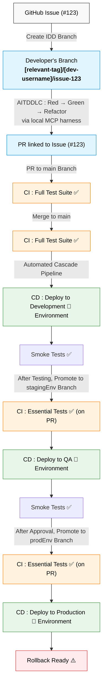

# CI / CD Pipeline Documentation

## Overview

Production-Ready Continuous Integration (CI) / Continuous Deployment (CD) Pipelines for the PEND Stack Boilerplate.

### What's Included?

- ✅ **CI Pipeline** : Automated Testing on Every PR & Push
- ✅ **CD Pipeline** : Automated Deployment to Development / Staging / Production Environments
- ✅ Cost Optimization : Hybrid Strategy & Layered Caching (10GB Limit Management)
- ✅ **Security Scans** : Trivy, `npm audit`, Safety Checks
- ✅ **Dependabot AI Review** : Gemini `PRReviewerAgent` (powered by `google-genai` SDK using `gemini-3.7-flash`) reviews Dependabot PRs; Maintainers Squash-Merge Manually (No Auto-Merge)
- ✅ **Multiple Quality Gates** : 7 Validation Points before Production Deployment

---

## 🚀 Quick Start

### 1. Prerequisites

- GitHub Repository with Actions Enabled
- Required Secrets Configured (See Below 👇)
- Branch Protection Rules Set Up (Recommended)

### 2. Configure GitHub Secrets

⚠️ **REQUIRED Before First Run!**

Go To : `Repository Settings` → `Secrets and variables` → `Actions` → `New repository secret`

Add These Secrets :

| Secret Name               | REQUIRED?                                              | Purpose                   |
| ------------------------- | ------------------------------------------------------ | ------------------------- |
| `CODECOV_TOKEN`           | Optional                                               | Code Coverage Reporting   |
| `CHROMATIC_PROJECT_TOKEN` | Optional                                               | Storybook Deployment      |
| `EXPO_TOKEN`              | Required (For Mobile Application Design & Development) | Mobile Application Builds |

📚 **Detailed Instructions** :

[GITHUB_SECRETS_SETUP.md](./GITHUB_SECRETS_SETUP.md)

### 3. Test the Pipeline

```bash
# Create Test Branch
git checkout -b test/your-username/verify-pipeline

# Make A Change
echo "# Pipeline Test" >> README.md
git add README.md
git commit -m "test : Verify CI / CD Pipeline"

# Push & Create PR
git push origin test/your-username/verify-pipeline
```

Go To : GitHub → Create PR to `main` → **CI Runs Automatically!**

---

## 📂 Documentation Files

| File                                                 | Purpose                              |
| ---------------------------------------------------- | ------------------------------------ |
| [README.md](./README.md)                             | This File - Overview & Quick Start   |
| [GITHUB_SECRETS_SETUP.md](./GITHUB_SECRETS_SETUP.md) | Complete Secrets Configuration Guide |
| [STRATEGY.md](./STRATEGY.md)                         | Testing Strategy & Cost Optimization |
| [TROUBLESHOOTING.md](./TROUBLESHOOTING.md)           | Common Issues & Solutions            |
| [MAINTENANCE.md](./MAINTENANCE.md)                   | Dependabot Handling & Upgrade Loop   |
| [UPGRADE_GUIDE.md](./UPGRADE_GUIDE.md)               | Major Version Upgrade Procedures     |

---

## 🔄 Git Workflow



### Branch Naming Convention

```
Format : [relevant-tag]/[dev-username]/issue-[issue-number]

Examples :
- feature/jzhk/issue-123 # New Feature linked to Issue #123
- fix/ijs/issue-456 # Bug Fix linked to Issue #456
- documentation/smd/issue-789 # Documentation updates linked to Issue #789
```

### Relevant Tags

- **`feature/`** : Indication of New Feature or Functionality or a significant enhancement into the system

- **`fix/`** : Signifies Bug or Error Fixes in the system

- **`documentation/`** : Changes to the Documentation File(s)

- **`style/`** : Addition / Changes to Design Styles of the Application UI / UX

- **`refactor/`** : Code Refactoring (Variable Renaming / Code Restructuring or Formatting) that doesn't affect Functionality

- **`data/`** : Used for Database, Information & Data Manipulation

- **`test/`** : Adding, Fixing or Modifying Tests; No Production Code Change

- **`chore/`** : Updating Build Scripts / Upgrading Dependencies, Maintenance & Changes in Tools; No Production Code Change

- **`cicd/`** : Changes to CI / CD Configuration or Scripts

- **`performance/`** : Performance Improvements / Optimization Changes

- **`devEx/`** : Developers' Experience : Use for Improvement of Developers' Experience

- **`revert/`** : Undoing the Changes made by a Previous Commit

- **`miscellaneous/`** : Use for anything that does not clearly fall into any of the previous categories

### Special Branches

**Backup Branches** (Before Major Upgrades) :

```bash
backup/pre-[update]-[YYYYMMDD]

Examples:
- backup/pre-django5-20241218 # Django Upgrade : Backup Taken On December 18, 2024
- backup/pre-nextjs16-20241220 # NextJS Upgrade : Backup Taken On December 20, 2024
```

**CI/CD** : ❌ Not Triggered (Snapshot Only)

**Upgrade Branches** (Major Version Upgrades) :

```bash
chore/upgrade/backend     # Django, Python, Backend Dependencies Upgrade
chore/upgrade/frontend    # NextJS, ReactJS, Frontend Dependencies Upgrade
chore/upgrade/mobile      # Expo, React Native, Mobile Dependencies Upgrade
chore/upgrade/database    # PostgreSQL Upgrade
```

**CI / CD** : ✅ Full Testing + Manual Approval

**Important** : Always Create `backup` Branch **BEFORE** `upgrade` Branch

---

## 🧪 What Gets Tested

### CI Pipeline (Continuous Integration)

**On Pull Requests to `main` / `devEnv`** :

- ✅ Backend Tests (pytest) with Coverage
- ✅ Frontend Tests (Jest) with Coverage
- ✅ Mobile Tests (Jest + Expo)
- ✅ Linting (Black, Flake8, ESLint)
- ✅ Type Checking (TypeScript)
- ✅ Docker Builds (backend, frontend)
- ✅ Security Scan (Trivy, `npm audit`, safety)
- ✅ E2E Tests (Cypress)
- ✅ Storybook Build + Chromatic Deployment

**On Pull Requests to `stagingEnv` / `prodEnv`** :

- ✅ Backend Tests (Essential)
- ✅ Frontend Tests (Essential)
- ✅ Mobile Tests
- ✅ Docker Builds
- ✅ Security Scan

**Duration** : ~9-17 Minutes Per Execution

#### 📦 Layered Caching Strategy

To stay within the 10GB GitHub Actions Storage Limit, the Pipeline uses a Decoupled Caching Approach :

- **Primary Cache** : `node_modules` & Global Binaries (Keyed by `package-lock.json`).
- **Secondary Cache** : `.next/cache` & Build Artifacts (Keyed by Commit SHA).

_This prevents frequent Build Updates from bloating the total Storage & triggering Premature Cache Eviction._

### CD Pipeline (Continuous Deployment)

**On Push to `devEnv` / `stagingEnv` / `prodEnv`** :

- ✅ Re-Run Tests (Can be Skipped Manually)
- ✅ Build Docker Images
- ✅ Push to GitHub Container Registry (GHCR)
- ✅ Deploy to Target Environment
- ✅ Run Database Migrations
- ✅ Smoke Tests (`devEnv` / `stagingEnv` Only)
- ✅ Automatic Rollback (Production Failures)

**Duration** : ~10-15 Minutes Per Deployment

---

## 💰 Cost & Usage

### Monthly GitHub Actions Usage

**Hybrid Strategy (Default)** :

`main` Branch : ~1,870 Minutes (5 Pushes / Day)
`devEnv` Branch : ~748 Minutes (2 Pushes / Day)
PRs to `stagingEnv` Branch : ~36 Minutes (1 Push / Week)
PRs to `prodEnv` : ~18 Minutes (2 Pushes / Month)

**Total** : ~1,672 Minutes / Month

**GitHub Free Tier** : 2,000 Minutes / Month  
**Remaining Buffer** : 328 Minutes  
**Monthly Cost** : **$0** ✅

### Want Full Testing?

Enable Testing on All Branches by Editing `.github/workflows/ci.yml` :

```yaml
on:
  push:
    branches:
      - main
      - devEnv
      - stagingEnv # Add This
      - prodEnv # Add This
```

**New Usage** : ~2,672 Minutes / Month (~$5.38 / Month Overage)

---

## 📊 Pipeline Status

### Check Status

[](https://github.com/your-org/pend-boilerplate/actions)

### View Logs

1. Go to Repository on GitHub
2. Click `Actions` Tab
3. Select a Workflow Run
4. Click on Job to View Logs

### Workflow Files

- `.github/workflows/ci.yaml` - Continuous Integration
- `.github/workflows/cd.yaml` - Continuous Deployment
- `.github/workflows/branch-cascade.yaml` - Automated Environment Branch Cascade
- `.github/workflows/dependabot-ai-fixer.yaml` - Dependabot CI Self-Healing
- `.github/workflows/dependabot-auto-merge.yaml` - Dependabot AI PR Review & Approve (`review-and-approve`; No Auto-Merge; `contents: read`)

---

## 🛡️ Security Features

### Automated Scans

- **Trivy** - Container Vulnerability Scans
- **`npm audit`** - NodeJS Dependency Vulnerabilities
- **Safety** - Python Dependency Vulnerabilities
- **SARIF Upload** - Results Sent to GitHub Security Tab

#### Trivy DB Reliability Note

Trivy downloads its Vulnerability Databases during CI. To avoid transient GHCR Rate-Limits (Example : `TOOMANYREQUESTS`), the Pipeline uses the Trivy DB ECR Mirror :

- `TRIVY_DB_REPOSITORY=public.ecr.aws/aquasecurity/trivy-db:2`
- `TRIVY_JAVA_DB_REPOSITORY=public.ecr.aws/aquasecurity/trivy-java-db:1`

SARIF Upload is guarded so CI won’t fail if Trivy couldn’t generate `trivy-results.sarif`.

### Secret Management

- All Secrets Stored in GitHub Secrets (Encrypted)
- No Secrets Committed to Repository
- Test Credentials Clearly Marked
- GitGuardian Monitoring Enabled

---

## 🎯 Quality Gates

Every Code Change Passes through Multiple Validation Points :

1. **AITDDLC Local Harness** - Developer / AI executes local Unit & Integration Tests (Red-Green-Refactor) via `.mcp/harness/` before pushing
2. **PR CI** - Full Test Suite on Pull Request
3. **Main CI** - Full Test Suite After Merge
4. **Development Deployment** - Smoke Tests in Development
5. **Staging PR** - Essential Tests Before QA
6. **Staging Deployment** - Smoke Tests in QA
7. **Production PR** - Final Validation Before Production Deployment
8. **Production Deployment** - With Rollback Capability

**Result** : Highly Reliable, Well-Tested Deployments 🛡️

---

## 🔗 Related Documentation

### Internal

- [GitHub Secrets Setup](./GITHUB_SECRETS_SETUP.md)
- [Testing Strategy](./STRATEGY.md)
- [Troubleshooting](./TROUBLESHOOTING.md)
- [Maintenance Guide](./MAINTENANCE.md)
- [Contributing Guidelines](../../CONTRIBUTING.md)
- [Pull Request Template](../../.github/PULL_REQUEST_TEMPLATE.md)

### External

- [GitHub Actions Documentation](https://docs.github.com/en/actions)
- [Codecov Documentation](https://docs.codecov.com)
- [Chromatic Documentation](https://www.chromatic.com/docs)
- [Expo EAS Build](https://docs.expo.dev/build/introduction/)

---

## 🆘 Need Help?

### Common Issues

See [TROUBLESHOOTING.md](./TROUBLESHOOTING.md)

### Getting Support

- 💬 [GitHub Discussions](https://github.com/your-org/pend-boilerplate/discussions)
- 🐛 [Report Issues](https://github.com/your-org/pend-boilerplate/issues)
- 📧 Contact Maintainers

---

## 🎉 Summary

**You Now Have** :

- ✅ Production-Ready CI / CD Pipelines
- ✅ Cost-Optimized Testing & Storage Strategy
- ✅ Multiple Quality Gates
- ✅ Automated Deployments
- ✅ Security Scans
- ✅ Comprehensive Documentation

**Monthly Cost** : $0 (Stays Within Free Tier)

**Ready to Develop?** Create A Branch & Start Coding ! 🚀

---

**Last Updated** : September 07, 2026
**Status** : Production-Ready (AITDDLC & IDD Integrated) ✅
